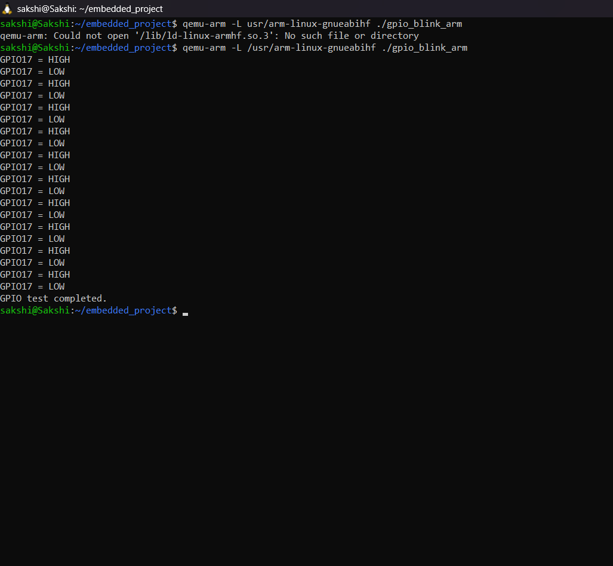

# Embedded Linux GPIO Sensor Project

Embedded Linux GPIO and temperature sensor simulation using C, ARM cross compilation, and QEMU.
## Project Overview

This project demonstrates basic Embedded Linux development using C programming. GPIO control and a DS18B20 temperature sensor are simulated using Linux file interfaces. The applications are cross-compiled for ARM and executed using QEMU emulation.
## How It Works

1. GPIO17 is simulated using a Linux file interface.
2. The C program sets GPIO17 HIGH and LOW.
3. A simulated DS18B20 sensor provides temperature data.
4. The C program reads and parses the sensor data.
5. The temperature is logged into a CSV file.
6. ARM binaries are executed using QEMU.

## QEMU GPIO Test

## Features

- GPIO control using C
- DS18B20 temperature sensor simulation
- ARM cross-compilation
- QEMU ARM emulation
- Temperature data logging to CSV

- ## Technologies Used

- C Programming
- Embedded Linux
- ARM GCC Cross Compiler
- QEMU
- Linux / WSL2
- GPIO and 1-Wire Sensor Concepts
